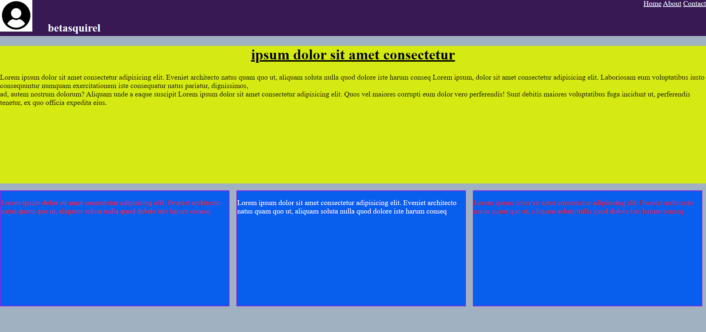
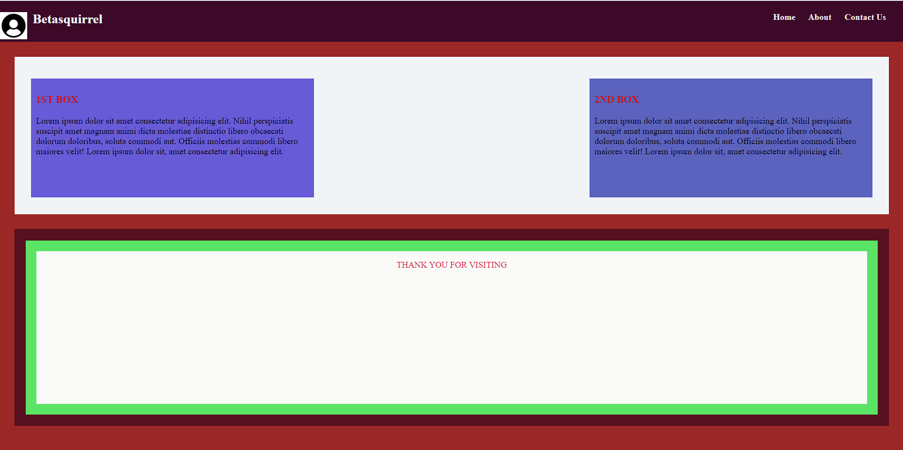
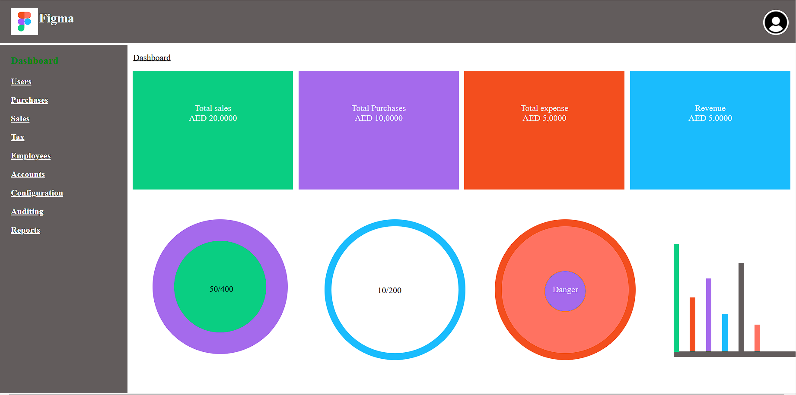

# betaquirrel-tasks

Betasquirrel assignments

| Output                       |
| ---------------------------- | ---------------------------- |
| Requrements                  | Output                       |
| ---------------------------- | ------------                 |
|   |  |

### **Second task**

| Requrements                 | Output                       |
| --------------------------- | ---------------------------- |
|  |  |

### **Task 3**

- [HTML Basic](https://www.w3schools.com/html/default.asp)
- [HTML Elements](https://www.w3schools.com/html/html_basic.asp)
- [html Attributes](https://www.w3schools.com/html/html_attributes.asp)
- [HTML Headings](https://www.w3schools.com/html/html_headings.asp)
- [HTML Paragraphs](https://www.w3schools.com/html/html_paragraphs.asp)
- [HTML Styles](https://www.w3schools.com/html/html_styles.asp)
- [HTML Text Formatting](https://www.w3schools.com/html/html_formatting.asp)
- [HTML Comments](https://www.w3schools.com/html/html_comments.asp)
- [HTML Colors](https://www.w3schools.com/html/html_colors.asp)
- [HTML Links](https://www.w3schools.com/html/html_links.asp)
- [HTML Images](https://www.w3schools.com/html/html_images.asp)
- [HTML Favicon](https://www.w3schools.com/html/html_favicon.asp)
- [HTML Tables](https://www.w3schools.com/html/html_tables.asp)
- [HTML Table Borders](https://www.w3schools.com/html/html_table_borders.asp)

### **Fourth task**

| Requrements                 | Output                       |
| --------------------------- | ---------------------------- |
|  |  |

### **Linux Commands**

| _Commands_ |                                   | _Example_             |
| ---------- | --------------------------------- | --------------------- |
| `cd`       | Change currentdirectory           | `cd Desktop`, `cd ..` |
| `ls`       | List contents of a directory      | `ls -a`               |
| `pwd`      | Display current working directory | `pwd`                 |
| `cat`      | Display contentsof a file         | `cat README.md`       |

### **Git Commands**

| _Commands_      |                                        | _Example_                                                        |
| --------------- | -------------------------------------- | ---------------------------------------------------------------- |
| 1. `git config` | Configure git user                     | `git config --global user.name "username"`                       |
| 2. `git clone`  | Clone a remorte git repo to your local | `git clone https://github.com/yadukrishnak/betasquireltasks.git` |
| 3. `git add`    | Add your file changes to git           | `git add .`                                                      |
| 4. `git commit` | Commit changes to git                  | `git commit -m "internal commit"`                                |
| 5. `git push`   | Push your local commits to remote repo | `git push origin main`                                           |

### Task 5

- [HTML Favicon](https://www.w3schools.com/html/html_favicon.asp)
- [HTML Tables](https://www.w3schools.com/html/html_tables.asp)
- [HTML Table Borders](https://www.w3schools.com/html/html_table_borders.asp)
- [HTML Table Sizes](https://www.w3schools.com/html/html_table_sizes.asp)
- [HTML Table Headers](https://www.w3schools.com/html/html_table_headers.asp)
- [HTML Table Padding & Spacing](https://www.w3schools.com/html/html_table_padding_spacing.asp)
- [HTML Table Colspan & Rowspan](https://www.w3schools.com/html/html_table_colspan_rowspan.asp)
- [HTML Table Styling](https://www.w3schools.com/html/html_table_styling.asp)
- [HTML Table Colgroup](https://www.w3schools.com/html/html_table_colgroup.asp)

\\

### **Task 6**

- [Click here](https://yadukrishnak.github.io/betasquireltasks/)
